# Инструкция по использованию Zeon Game Bot

Добро пожаловать! Ниже представлена инструкция по настройке и работе с игровым ботом для игры Puzzle & Survival.

## Наши преимущества

* Вам не нужно устанавливать дополнительный софт!

* Мы создаём эмулятора на нашем сервере, на котором в последствии будет запущена игра с вашим игровым аккаунтом.

* Использование нейросетей для распознавания событий, что даёт возможность применение умной и гибкой логики.

* Бот может работать круглосуточно, запуск и остановка производится из интерфейса телеграм.

* Очень гибкая настройка поведения бота.

* Защитные действия при нападении на базу игрока.

* Подробное логирование о действиях бота.

* Поддержка любого количества персонажей в рамках одного игрового аккаунта.

* Активная поддержка бота.

\newpage

## 1. Регистрация

### 1.1. С чего начать?

Для начала использования бота перейдите в по ссылке в **Telegram:** [\textcolor{blue}{@ZeonGameBot}](https://t.me/ZeonGameBot) (нажмите по нику чтобы перейти в Telegram).

### 1.2. Процесс регистрации в боте  

  Шаг 1. Введите или выберете команду **/start**.

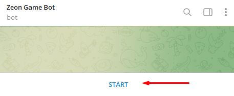

  Шаг 2. Нажмите "Зарегистрироваться".

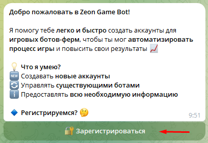

  Шаг 3. Введите E-mail к которому у вас есть доступ для подтверждения регистрации в ZeonBot.

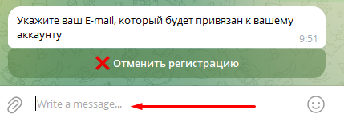

  Шаг 4. Введите имя вашего аккаунта в ZeonBot.

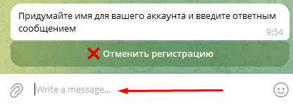

  Шаг 5. Введите надёжный пароль.

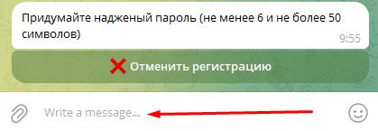

  Шаг 6. На этом этапе вам отправлено письмо с подтверждением на email, который вывводили на шаге.3. Перейдите по ссылке в письме, чтобы подтвердить почту.

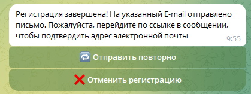

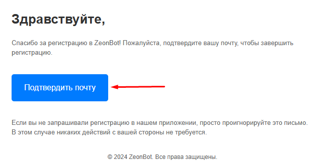

  Шаг 7. После подтверждения вы увидете соледующее сообщение. Нажмите команду **/start**. Чтобы начать процесс создания внутриигрового бота.

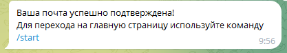

### 1.3. Создание игрового бота

  Шаг 1. Для создание внутриигрового бота. нажмите на кнопку **Создать игрового бота**.

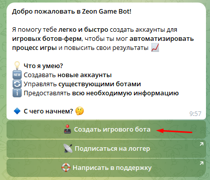

  Шаг 2. Выберете игру из списка доступных.

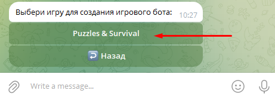

  Шаг 3.  Придумайте и введите имя для вашего игрового бота.

**Примечание:** Это имя может быть любым и не обязано соответствовать внутриигровому имени персонажа. Оно используется только для объединения последующей логики игрового бота в отдельную группу.

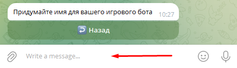

  Шаг 4. Выберите платформу для входа в внутриигровой аккаунт.

После этого шага вам будут приходить сообщения которые запросят проверочные данные для входа в ваш игровой аккаунт. Убедитесь в том что у вас есть доступ к аккаунтам через которые вы планируете совершить авторизацию.

\textcolor{red}{ВАЖНО:} Мы не храним логины и пароли от учетных записей, через которые вы авторизируетесь в игре. В целях безопасности все данные передаются в зашифрованом виде.

**Если вы переживаете за конфиденциальность данных, то сразу после авторизации в боте можно сменить пароли, это никак не повлияет на привязку игрового аккаунта к боту.**

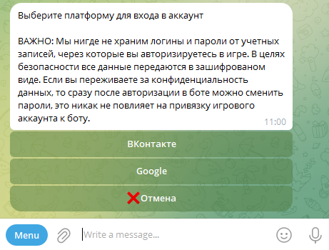

\textcolor{red}{ВАЖНО!} Этап подготовки эмулятора к входу в внутриигровой аккаунт на наших серверах займёт некоторое время, следите за сообщениями получаемые в telegram от Zeon Game Bot.

  Шаг 5. Последовательно вводите запрашиваемые ботом данные в зависимости от выбраного способа авторизации. 

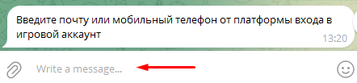

Например для авторизации через Google потребудется ввести вашу почту и пароль, либо пройти двухэтапную аутентификацию как показано на изображениях ниже.

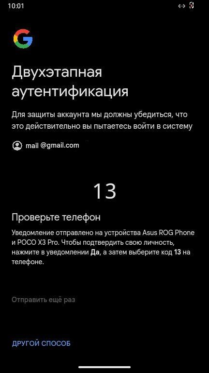

\textcolor{red}{ВАЖНО!} После прохождения процедуры входа в внутриигровой аккаунт за вами будет закреплено место на нашем сервере, создан эмулятор android для вашего аккаунта и получен список персонажей доступных к использованию. 

  * \textcolor{red}{ОЧЕНЬ ВАЖНО! БОТ РАБОТАЕТ ТОЛЬКО С ПЕРСОНАЖАМИ ЧЕЙ УРОВЕНЬ ШТАБ-КВАРТИРЫ ВЫШЕ 9-ГО УРОВНЯ.}

### 1.3. Один бот = один игровой аккаунт

\textcolor{red}{ВАЖНО!} Один бот закреплен за одним игровым аккаунтом. У вас не получится привязать второй игровой аккаунт к одному боту. Переход между игровыми аккаунтами при работе бота не осуществляется. Бот меняет только персонажей в рамках одного игрового аккаунта.

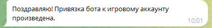

\newpage

## 4. Подписка на логгер

Логгер это сервис в который приходят уведомления о различных событиях случившихся в процессе работы бота. Например нападение на базу, скриншоты сбора ресурсов и т.д.

### 4.1. Как подписаться
Для подписки на бот логера нужно перейти по ссылке **после** регистрации   [\textcolor{blue}{@ZeonGameLoggerBot}](https://t.me/@ZeonGameLoggerBot) или нажать на кнопку "Подписаться на логгер" в основном боте [\textcolor{blue}{@ZeonGameBot}](https://t.me/ZeonGameBot).

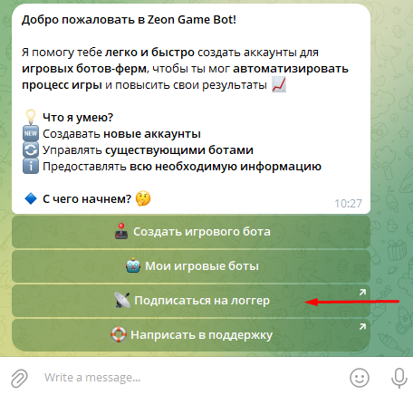

После открытия логгер-бота введите команду /start или нажать кнопку "start".

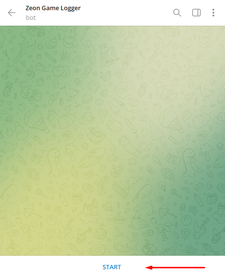

Всё готово, логгер подключен!

\newpage

## 4. Настройка бота

### 4.1 Выбор активных персонажей

\textcolor{red}{ВАЖНО!} Во время сбора списка доступных персонажей мы определяем их позицию в списке персонажей в меню игры.

Список доступных персонажей находится в меню "Активные персонажи". Нажмите на него.

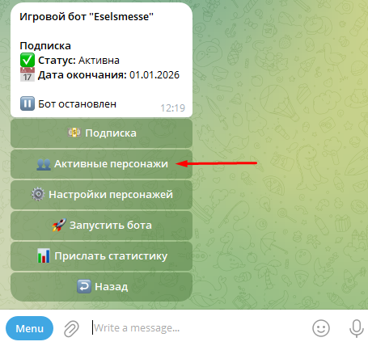

Для выбора персонажа необходимо нажать на персонажа. Если появилась галочка - значит персонаж выбран и будет учавствовать в ротации персонажей при работе бота.

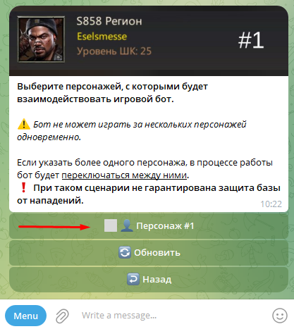

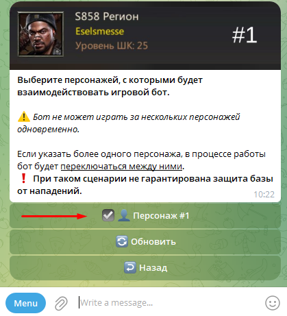

### 4.2 Обновление списка персонажей

\textcolor{red}{ВАЖНО!} Бот работает с позицией персонажа в списке персонажей в игре. Если какой-либо из доступных персонажей поменяет свою позицию в списке это приведёт к ошибкам в работе бота. 

**Причины перемещение персонажа в списке:**

1. Добавление нового персонажа.

2. Перемещение персонажа в другой регион.

3. Переименование персонажа.

**Чтобы этого избежать необходимо обновить список персонажей, нажав на кнопку "Обновить".**

\textcolor{red}{ВАЖНО!} Это приведёт к сбросу настроек персонажей.

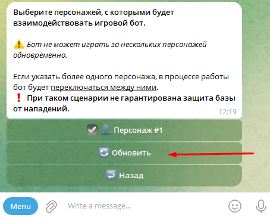

### 4.3 Настройка персонажей

Для настроек конкретного персонажа нужно перейти в меню "Настройка персонажей".

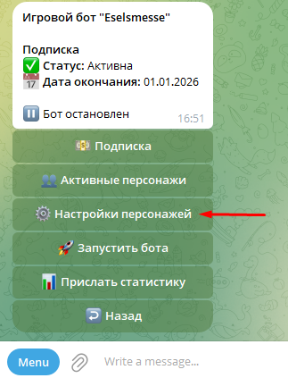

Далее необходимо выбрать персонажа для которого вы будете задавать настройки.

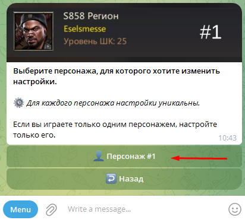

\newpage

## 5. Типы настройки

В своём базовом состоянии бот выполнит все суточные квесты, но для эффективной работы необходима настройка в зависимости от ваших возможностей и потребностей.

### 5.1 Быстрые настройки

Если вы хотите посмотреть на что способен бот лучшим способом будет использовать **"Быстрые настройки"**. Это блиц-опрос из ключевых параметров работы с ботом который позволит начать здесь и сейчас, но помните что бот является **ОЧЕНЬ ГИБКИМ** в своих настройках.

\textcolor{red}{ВАЖНО!} Использование **быстрой настройки** приведёт к сбросу настроек персонажей.

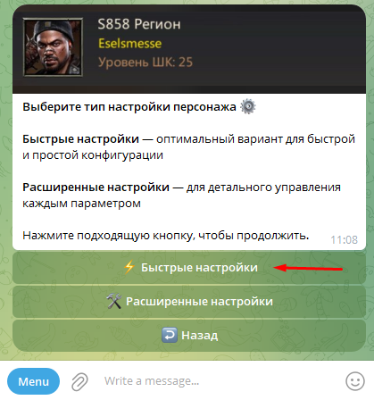

### 5.2 Расширенные настройки

Для полноценной настройки персонажа зайдите в меню **Расширенные настройки**. Там у вас будет возможность задать большое количество параметров регламентирующих поведение бота. 

  * Рекомендуем держать игру открытой во время установки **Расширенных настроек**, так ориентирование в настройках будет более интуитивным и поможет вам выжать максимум из бота.

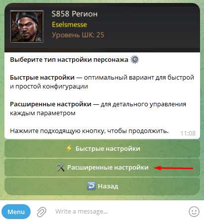

\newpage

## 6. Описание механик и связанных с ними параметров

В этой главе приведены описания того, что делает бот в каждой из игровых механик. Гиперссылками (текст синего цвета) выделены связанные с механикой параметры. При наведении на гиперссылку всплывет меню с подсказкой о том, что делает конкретный параметр. 

Более подробное описание и советы по настройке параметров описаны в 7 главе.

### Мировая карта
**Описание механики:**

1. Проверка на игнорирование механики \ParamLink{Игнорируемые механики (Сбор ресурсов на карте мира)}{ignor_states}{Выбранные механики которые будут игнорироваться при работе бота}.

2. Вход в меню маршей и учёт количества доступных маршей в зависимости от \ParamLink{Число маршей}{march_max_count}{Количество маршей доступных для сбора ресурсов и походов на логово зомби. Количество доступных маршей можно узнать внутри игры [Меню командира=>Усиления=>Усиления Марша=>Лимит Марша]} – один марш всегда выделяется для боевых действий. Если количество выносливости превышает \ParamLink{Порог выносливости}{stamina_threshold}{Значение минимального количества выносливости, при достижении которого будет резервироваться один боевой марш, для участия в походах на логова зомби} если ниже порогового значения, то боевой марш не резервируется.

3. Применяется ускорение сбора, если есть разрешение \ParamLink{Ускорение сбора}{sr_tile_speed_up}{Разрешение на применение ускорений для сбора ресурсов}. Покупает за алмазы, если это необходимо и есть разрешение \ParamLink{Покупка ускорений}{sr_tile_speed_up_buy}{Разрешение на покупку ускорений за алмазы перед сбором ресурсов}.

4. Для сбора ресурсов приоритетно выбираются наездники (самые быстрые). Производится расчёт необходимого количества юнитов для сбора каждого ресурса, чтобы не тратить на это время в процессе формирования отряда.  

  * Быстрый сбор \ParamLink{Быстрый сбор плитки}{map_speed_up}{Разрешение на использование механики быстрого сбора плитки. При быстром сборе не проверяется число ресурсов на плитке, однако вероятность пересечения маршей сокращается в разы} — полезен после события «Доблестное завоевание».

5. Поиск заданных ресурсов \ParamLink{Основной ресурс}{map_main_resource_type}{Ресурсы для беспрерывной добычи на мировой карте} и ресурсов для выполнения дневного задания.

6. Установка уровня ресурса, с которого начинается поиск \ParamLink{Уровень ресурса}{map_resource_start_lvl}{Уровня ресурсной плитки с которой начнется поиск. Если плиток с таким уровнем не обнаружено, уровень будет понижен.}.

7. Поиск ресурсов и проверка на пустошь в зависимости от параметра \ParamLink{Сбор ресурсов в Пустоши}{map_resource_allow_wasteland}{Разрешение добывать ресурсы на клетках пустоши (зоны вокруг технического центра, в центре карты)}.

8. Отправка отряда на сбор ресурса.

9. Проверка на пересечение маршей. Изредка бот ошибается, поэтому **ВСЕГДА** отзываем отправленный марш. Если в инвентаре нет отзыва марша, пытаемся купить и применить его, если есть разрешение \ParamLink{Отзыв марша за алмазы}{march_recall_gem_usage}{Разрешение на использование алмазов для отзыва маршей в случае пересечения маршей с другими игроками. Стоимость 400 алмазов}.

10. Когда все марши на сбор ресурсов отправлены, начинается инициализация атаки логова зомби. Выполняется поиск логова заданного уровня \ParamLink{Уровень атаки (создание)}{lair_lvl}{Уровень логова для начала групповой атаки}.

11. Устанавливается время ожидания \ParamLink{Время ожидания атаки}{lair_time}{Время ожидания для самостоятельного сбора группы перед атакой на логово зомби на мировой карте и в групповом сражении.}.

12. Формируется моно-отряд из указанного типа юнитов \ParamLink{Основной тип юнитов}{unit_type}{Тип юнита для формирования боевого моно отряда при атаке на логово зомби, захвата редкоземельной ямы и арены «Завоевание».}.

### Тренировочные лагеря
**Описание механики:**

1. Проверка на игнорирование механики \ParamLink{Игнорируемые механики (Тренировочные лагеря)}{ignor_states}{Выбранные механики которые будут игнорироваться при работе бота}.

2. Обучение/улучшение \ParamLink{Тип обучения}{train_type}{Способ обучения в тренировочном лагере.} 250 юнитов, которых нет в списке \ParamLink{Типы юнитов для обучения}{train_unit_types}{Список типов юнитов которые будут улучшены или обучены}, для выполнения ежедневного задания.

3. Обучение/улучшение \ParamLink{Тип обучения}{train_type}{Способ обучения в тренировочном лагере.} максимального числа выбранных типов юнитов \ParamLink{Типы юнитов для обучения}{train_unit_types}{Список типов юнитов которые будут улучшены или обучены}.

  * Если выбрано «улучшение», но улучшать некого — обучаются новые юниты самого высокого тира.

  * Проверка на нехватку ресурсов \ParamLink{Ресурсы со склада}{store_permit}{Разрешение на использование реурсов со склада, в случае их нехватки для старта активности} выполняется перед каждой отправкой юнитов.

### Таверна
**Описание механики:**

1. Проверка на игнорирование механики \ParamLink{Игнорируемые механики (Ноева таверна)}{ignor_states}{Выбранные механики которые будут игнорироваться при работе бота}.

2. Поиск и применение бесплатного найма.

### Склад снабжения
**Описание механики:**

1. Проверка на игнорирование механики \ParamLink{Игнорируемые механики (Склад снабжения (вертолёт))}{ignor_states}{Выбранные механики которые будут игнорироваться при работе бота}.

2. Распознавание количества доступных кликов.

3. Распределение и осуществление бесплатных кликов по выбранным ресурсам \ParamLink{Виды ресурсов}{supply_priority}{Типы ресурсов для распределения кликов}.

4. Расчёт и осуществление платных кликов по выбранным ресурсам \ParamLink{Виды ресурсов}{supply_priority}{Типы ресурсов для распределения кликов} на основе уже распределённых бесплатных кликов согласно установленному бюджету \ParamLink{Ежедневный бюджет}{supply_diamonds_count}{Ежедневный бюджет алмазов для траты на платные клики}.

### Магазин наличных
**Описание механики:**

1. Проверка на игнорирование механики \ParamLink{Игнорируемые механики (Магазин наличных)}{ignor_states}{Выбранные механики которые будут игнорироваться при работе бота}.

2. Переход во вкладку «Особые предложения».

3. Сбор бесплатного суточного ящика.

4. Сбор наград в шкале «Прогресс Наград за Покупки».

### Руины
**Описание механики:**

1. Проверка на игнорирование механики \ParamLink{Игнорируемые механики (Руины)}{ignor_states}{Выбранные механики которые будут игнорироваться при работе бота}.

2. Поиск и прохождение всех испытаний до первого поражения.

3. Поиск и сбор всех сундуков с наградами.

### Викторина
**Описание механики:**
1. Проверка на игнорирование механики \ParamLink{Игнорируемые механики (Викторина)}{ignor_states}{Выбранные механики которые будут игнорироваться при работе бота}.
2. Выбор правильного ответа из базы вопросов и ответов.

* База вопросов и ответов пополняется автоматически и работает для всех пользователей.

### Квест
**Описание механики:**

1. Проверка на игнорирование механики \ParamLink{Игнорируемые механики (Квест)}{ignor_states}{Выбранные механики которые будут игнорироваться при работе бота}.

2. Сбор выполненных ежедневных заданий для получения пунктов.

3. Сбор ящиков за пункты.

### Нова
**Описание механики:**

1. Проверка на игнорирование механики \ParamLink{Игнорируемые механики (Нова)}{ignor_states}{Выбранные механики которые будут игнорироваться при работе бота}.

2. Проверка наличия и применение бесплатного исследования биомодификаторов.

3. Применение выбранного отношения \ParamLink{Отношения}{nova_priority}{Тип взаимодействия с Новой, приносящий разные награды, Близость [очки опыта Новы], Похвала [военные/экономические очки Новы], Подарок [150к дерева]}.

### Лайк
**Описание механики:**

1. Проверка на игнорирование механики \ParamLink{Игнорируемые механики (Лайк)}{ignor_states}{Выбранные механики которые будут игнорироваться при работе бота}.

2. Вход в таблицу лидеров.

3. Клик по кнопке «Лайк» самому сильному игроку.

### Редкоземельная яма
**Описание механики:**

1. Проверка на игнорирование механики \ParamLink{Игнорируемые механики (Редкоземельная яма)}{ignor_states}{Выбранные механики которые будут игнорироваться при работе бота}.

2. Атака на закрытый уровень поля.

3. Вход в заданный уровень поля \ParamLink{Уровень поля}{hole_target_level}{Уровень поля в которое бот заходит для поиска противника}.

4. Бот ищет игроков, отмеченных как слабые, сначала в первых 5 секторах (с увеличенной добычей), затем — с конца поля.

5. При обнаружении слабого соперника бот проверяет, что процент заполнения ямы выше \ParamLink{Минимальный процент}{hole_min_percent}{Минимальный процент заполненности ямы слабого противника, при котором начинается атака}, и атакует. Моноотряд формируется на основе \ParamLink{Основной тип юнитов}{unit_type}{Тип юнита для формирования боевого моно отряда при атаке на логово зомби, захвата редкоземельной ямы и арены «Завоевание».}.

  * При неудаче бот понижает \ParamLink{Минимальный процент}{hole_min_percent}{Минимальный процент заполненности ямы слабого противника, при котором начинается атака} на 1%. Если включён \ParamLink{Мирный режим}{hole_peaceful_mode}{Разрешение на занятие свободной редкоземельной ямы}, бот занимает свободную яму.

6. После исследования всех секторов, если противник не найден, бот понижает уровень поля \ParamLink{Уровень поля}{hole_target_level}{Уровень поля в которое бот заходит для поиска противника}.

  * Бот отзывает отряд при возможности, чтобы игрок не стал привлекательной целью для грабежа.

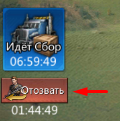

### Лазарет
**Описание механики:**

1. Проверка на игнорирование механики \ParamLink{Игнорируемые механики (Лазарет)}{ignor_states}{Выбранные механики которые будут игнорироваться при работе бота}.

2. Вход в центр глубокого исцеления и использование всех доступных нанопрепаратов.

3. Вход в основное меню лазарета.

4. Лечение юнитов начинается сверху вниз. Количество юнитов подбирается согласно \ParamLink{Время исцеления}{heal_timer}{Время исцеления одной партии юнитов (+/- 40 секунд)}.

5. Проверка на достаточное количество ресурсов \ParamLink{Ресурсы со склада}{store_permit}{Разрешение на использование реурсов со склада, в случае их нехватки для старта активности}.

6. Если альянс очень активен, можно подобрать \ParamLink{Время ожидания}{heal_wait_timer}{Время ожидания до отправки очередной партии на лечение} так, чтобы лечение юнитов происходило без остановки.

### Групповые сражения (присоединение)
**Описание механики:**

1. Проверка очков выносливости. Если количество выносливости превышает \ParamLink{Порог выносливости}{stamina_threshold}{Значение минимального количества выносливости, при достижении которого будет резервироваться один боевой марш, для участия в походах на логова зомби}, резервируется один марш из числа \ParamLink{Числа маршей}{march_max_count}{Количество маршей доступных для сбора ресурсов и походов на логово зомби. Количество доступных маршей можно узнать внутри игры [Меню командира=>Усиления=>Усиления Марша=>Лимит Марша]}.

2. Проверка на игнорирование механики \ParamLink{Игнорируемые механики (Групповые сражения (присоединение))}{ignor_states}{Выбранные механики которые будут игнорироваться при работе бота}.

3. Анализ наличия иконки групповых сражений.

4. Вычисление атак на логова зомби с учётом \ParamLink{Уровня атаки (присоединение)}{group_fight_min_lvl}{Минимальный уровень логова зомби для присоединения к групповой атаке} и \ParamLink{Времени ожидания атаки}{lair_time}{Время ожидания для самостоятельного сбора группы перед атакой на логово зомби на мировой карте и в групповом сражении.}

5. Проверка на \ParamLink{Переполнение сыворотки}{serum_limit_ignore}{Разрешение на игнорирование переполнения сыворотки при сборе ресурсов на базе и походах на логово зомби}.

6. Присоединение к атаке с формированием моно-отряда из \ParamLink{Основного типа юнитов}{unit_type}{Тип юнита для формирования боевого моно отряда при атаке на логово зомби, захвата редкоземельной ямы и арены «Завоевание».} или через кнопку «Быстрое присоединение».

### Центр садоводства
**Описание механики:**

1. Проверка на игнорирование механики \ParamLink{Игнорируемые механики (Центр садоводства)}{ignor_states}{Выбранные механики которые будут игнорироваться при работе бота}.

2. Сбор семян за квесты.

3. Посещение союзников для помощи с поливом.

4. Сбор наград из карты привилегий.

5. Сбор выросших растений.

6. Посадка семян.

### Центр подарков
**Описание механики:**

1. Проверка на игнорирование механики \ParamLink{Игнорируемые механики (Центр подарков)}{ignor_states}{Выбранные механики которые будут игнорироваться при работе бота}.

2. Сбор подарков в меню «Подарок за вход».

3. Сбор подарков в меню «План снабжения».

4. Сбор подарков в меню «Золотая месячная карта».

5. Сбор подарков в меню «Серебряная месячная карта».

### Кампания
**Описание механики:**

1. Проверка на очки выносливости. Если они выше \ParamLink{Порога очков действий}{action_points_threshold}{Значение с для минимального количества очков действий, при достижении которого будет запускаться механика фарма кампании}, осуществляется вход.

2. Проверка на игнорирование механики \ParamLink{Игнорируемые механики (Кампания)}{ignor_states}{Выбранные механики которые будут игнорироваться при работе бота}.

3. Выбор \ParamLink{Уровня сложности}{company_super_level}{Уровень сложности кампании от 1 до 3. Новая сложность открывается после полного прохождения 24 главы кампании}.

4. Поиск заданного уровня по параметру \ParamLink{Уровень}{company_level}{Уровень кампании для фарма от 1 до 24}. Если равен 0 или не найден, выбирается максимальный уровень – на 1 меньше максимума, а \ParamLink{Подуровень}{company_sublevel}{Подуровень кампании для фарма от 1 до 9} устанавливается на 1.

5. Вход в заданный \ParamLink{Подуровень}{company_sublevel}{Подуровень кампании для фарма от 1 до 9}. Если не найден, выбирается подуровень 1.

6. Проведение автоматических боёв либо использование блиц-токенов при включенноё \ParamLink{Трате блиц-токенов}{company_bliz}{Разрешение на использование блиц-токенов в кампании}, пока не исчерпаны очки действий.

7. Набор персонажей остаётся неизменным; при недостатке выбираются сильнейшие. Если бот проигрывает — \ParamLink{Уровень}{company_level}{Уровень кампании для фарма от 1 до 24} снижается, а \ParamLink{Подуровень}{company_sublevel}{Подуровень кампании для фарма от 1 до 9} становится равным 1.

8. Раз в сутки производится вход в главное испытание.

9. Вход в тюрьму согласно выбранному \ParamLink{Уровеню тюрьмы}{company_prison_level}{Уровень тюрьмы, в которую бот заходит.}, если ранее вход не осуществлялся.  

  * \textcolor{red}{Бот не проводит бои в тюрьме самостоятельно!}

### Банк
**Описание механики:**

1. Проверка на игнорирование механики \ParamLink{Игнорируемые механики (Банк)}{ignor_states}{Выбранные механики которые будут игнорироваться при работе бота}.  

2. Внесение депозита на срок \ParamLink{Срок депозита}{bank_deposit_type}{Срок, на который вносится депозит}. Если выбранный срок недоступен, выбирается депозит на 7 дней.

### Арсенал
**Описание механики:**

1. Проверка на игнорирование механики \ParamLink{Игнорируемые механики (Арсенал)}{ignor_states}{Выбранные механики которые будут игнорироваться при работе бота}.

2. Изготовление материалов для нанооружия. При наличии дополнительных производств \ParamLink{Материалов за алмазы}{arsenal_material_speed_up}{Количество дополнительных производств материалов, которые можно купить за алмазы в течении одного дня} они выполняются по мере доступности.

  * Стоимость дополнительного производства начинается с 200 алмазов и увеличивается на 200 алмазов после каждого дополнительного производства, вплоть до 1000.

3. Производство случайного нанооружия, если есть разрешение на \ParamLink{Создание оружия}{arsenal_make_mode}{Разрешение боту создавать нанооружие (случайное)}.

### Арена
**Описание механики:**

1. Проверка на игнорирование механики \ParamLink{Игнорируемые механики (Арена)}{ignor_states}{Выбранные механики которые будут игнорироваться при работе бота}.

2. Вход в меню Дуэль героев «Выживание».

3. При смене условий «Чрезвычайной ситуации» выбираются 5 сильнейших персонажей.

  * Обратите внимание: ротация может влиять на силу персонажей, поэтому следите за актуальностью группы.

4. Подбор оппонента за 15 минут:

  4.1. Поиск соперника с меньшей мощью.

  4.2. Если разрешено \ParamLink{Атаковать сильного соперника}{over_power_arena_fight}{Разрешение на сражение с сильными соперниками}, она активируется после 10 итераций поиска.

5. Формирование отряда: пустые слоты заполняются сильнейшими доступными героями.

6. Сражение в режиме автобоя.

7. После исчерпания бесплатных попыток используется заданное \ParamLink{Количество токенов дуэли}{arena_tokens}{Количество пропусков на дуэль в режиме «Выживание» которое бот использует в течении одного дня}.  

  * \textcolor{red}{Бот не покупает токены самостоятельно.}

  * Если доступно токенов больше, чем у игрока — используются все доступные.

8. Вход в меню Дуэль героев «Выживание».

9. Если требуется сформировать защитный отряд, он создаётся из \ParamLink{Основного типа юнитов}{unit_type}{Тип юнита для формирования боевого моно отряда при атаке на логово зомби, захвата редкоземельной ямы и арены «Завоевание».}.

10. При подборе оппонента для сражения используются \ParamLink{Атака сильного соперника}{over_power_arena_fight}{Разрешение на сражение с сильными соперниками} и после исчерпания бесплатных попыток используются токены для арены  \ParamLink{Количество токенов завоевания}{arena_tokens_conquest}{Количество пропусков на дуэль в режиме «Завоевание» которое бот использует в течении одного дня.}

  * \textcolor{red}{Бот не покупает токены самостоятельно.}

  * При поиске также проверяется, чтобы основной юнит был контр-юнитом против оппонента.

### Альянс
**Описание механики:**

1. Проверка на игнорирование механики \ParamLink{Игнорируемые механики (Альянс)}{ignor_states}{Выбранные механики которые будут игнорироваться при работе бота.}

2. Вход в меню исследований альянса.

3. Поиск технологии для исследования:

  3.1. Сначала выбирается технология с меткой «HOT».

  3.2. Если технология требует недоступный ресурс, то выбирается другая, по параметру \ParamLink{Исследование альянса}{alliance_res}{Тип ресурса который можем потратить на улучшение технологии альянса.}

  3.3. Пополнение происходит через \ParamLink{Ресурсы со склада}{store_permit}{Разрешение на использование реурсов со склада, в случае их нехватки для старта активности}.

4. Сбор подарков альянса.

5. Вход в магазин и покупка ускорителя один раз в день для выполнение я ежедневного задания, если есть разрешение на \ParamLink{Покупка буста}{boost_for_buy}{Разрешение на покупку буста в магазине альянса для выполнения дневного задания.}

### Редкоземельный магазин и Руинный магазин (работают одинаково)
**Описание механики:**

1. Для входа в магазины должен быть выбран хотя бы один товар из  \ParamLink{Списока товаров доступных к покупке}{rare_metal_item_list}{Товары, доступные для покупки в Редкоземельном магазине.}

2. Покупка товаров осуществляется в порядке выбора в меню Телеграма.

3. По умолчанию бот пытается купить 1 единицу товара из списка, чтобы выполнить ежедневный квест согласно \ParamLink{Режиму скупки}{rare_metal_store_mode}{Разрешение на полную скупку всех товаров указаных в списке доступных.}

4. Для скупки всех единиц необходимо разрешить полную скупку через \ParamLink{Режим скупки}{rare_metal_store_mode}{Разрешение на полную скупку всех товаров указаных в списке доступных}.

### Состояние войны
**Описание механики:**

1. Прерывание текущей механики и выход до уровня базы или карты.

2. Определение защитного сценария: надевание щита \ParamLink{Использование щита}{war_shield_activate}{Разрешение на применение доступных (бесплатных) щитов} или телепорта \ParamLink{Использование телепорта}{war_teleport_activate}{Разрешение на использование направленного телепорта}.

3. Выполнение защитного сценария:

**Надевание щита:**  

  * Вход в меню усиления убежища и поиск щитов.  

  * Используются щиты на 2 и 8 часов. Если бесплатных нет, покупается щит на 2 часа при разрешении \ParamLink{Покупка щита}{war_diamond_shield}{Разрешение на покупку щита за алмазы}.  

  * Если обнаружена боевая лихорадка, щит не надевается.

**Использование телепорта:**  

  * Переход на карту мира и ввод координат согласно режиму телепортации \ParamLink{Телепорт поблизости}{war_teleport_nearest}{Разрешение на телепортацию только вблизи базы (в радиусе 50 клеток)}.  

  * Если \ParamLink{Телепорт поблизости}{war_teleport_nearest}{Разрешение на телепортацию только вблизи базы (в радиусе 50 клеток)} отключён, перемещение производится по всей карте (исключая территорию пустоши, зоны вокруг технического центра).

  * При выборе обоих защитных сценариев приоритет отдается щиту \ParamLink{Использование щита}{war_shield_activate}{Разрешение на применение доступных (бесплатных) щитов}.

4. Если возникает восстание мертвецов, бот останавливает отправку маршей \ParamLink{Число маршей}{march_max_count}{Количество маршей доступных для сбора ресурсов и походов на логово зомби. Количество доступных маршей можно узнать внутри игры [Меню командира=>Усиления=>Усиления Марша=>Лимит Марша]} для максимизации защиты базы.

\newpage

# Расширенное описание параметров

Ниже приведён список параметров, их расширенное описание и влияние на процесс. Все параметры разделённый на группы так же как в телеграм боте. (Описание каждого параметра используется в подсказках к ссылкам в главе 6.)

## Общие

### Игнорируемые механики {#ignor_states}

* Выбранные механики которые будут игнорироваться при работе бота. 

На высоком уровне игры использование некоторых механик становится критичным. Если какие-то из них вам не нужны, вы можете добавить их в исключение. Название механик и их (подмеханик): Альянс (сбор подарков, исследование, покупки в магазине), Арена (проведение беслптных и платных боёв), Компания (расход ОД, активация тюрьмы, вход в главнео испытание), Теплица (посадка/сбор/полив семян членов альянса), Лазарет (исцеление юнитов). Мировая карта (отправка маршей на добычу ресурсов и логово зомби), Тренировочные лагеря (тренировка/улучшение юнитов). Неописанные выше механики не требуют затрат ресурсов.

### Переполнение сыворотки {#serum_limit_ignore}  

* Разрешение на игнорирование переполнения сыворотки при сборе ресурсов на базе и походах на логово зомби.

\textbf{Совет:} Для стабильной работы бота рекомендуем включить игнорирование переполнения сыворотки. В таком случае сыворотка на базе не будет собрана, а с походов на логово вы получите все возможные награды, кроме сыворотки. В случае переполнения вы получите уведомление в этом чате.

\textcolor{red}{ВАЖНО:} Если переполнение игнорирование не будет включено, походы на логово не будут осуществляться. Это приведёт к накоплению выносливости и неоптимальной работе бота.

### Порог выносливости {#stamina_threshold}

* Значение минимального количества выносливости, при достижении которого будет резервироваться один боевой марш, для участия в походах на логова зомби.

Если выносливости недостаточно для траты все марши будут направлены на сбор плиток. В противном случае один марш будет зарезервирован для боевых активностей. Ожидая атаки на логово от союзников или же инициируя собственную.

\textbf{Совет:} Если не хотите, чтобы бот тратил выносливость поставьте значение больше 300. Рекомендуемое значение - 80.

### Порог очков действий {#action_points_threshold}

* Значение с для минимального количества очков действий, при достижении которого будет запускаться механика фарма кампании.

Если не хотите, чтобы бот тратил очки действий поставьте значение больше 300. При достижении порогового значения, бот начнет тратить очки действий. Бот остановится после траты всех ресурсов.

### Ресурсы со склада {#store_permit}

* Разрешение на использование реурсов со склада, в случае их нехватки для старта активности.

### Число маршей {#march_max_count}

* Количество маршей доступных для сбора ресурсов и походов на логово зомби. Количество доступных маршей можно узнать внутри игры [Меню командира=>Усиления=>Усиления Марша=>Лимит Марша].

## Альянс

### Исследование альянса {#alliance_res}

* Тип ресурса который можем потратить на улучшение технологии альянса.

\textbf{Совет:} Получаемая награда не зависит от того, какой тип ресурса используется в прокачке технологии альянса, однако если исследование с текущей меткой "HOT" имеет ресурс, который не доступен для применения, ваши потери будут составлять -10%  [Монета Альянса], но более ценные ресурсы будут сэкономлены.

## Арена

### Атака сильного соперника {#over_power_arena_fight}

* Разрешение на сражение с сильными соперниками. Если разрешение на сражение с сильными противниками получено, после 10 попыток найти противника слабее нас будет произведено нападение на слабейшего из сильнейших.

### Количество токенов «Завоевание» {#arena_tokens_conquest}

* Количество пропусков на дуэль в режиме «Завоевание» которое бот использует в течении одного дня. Если токенов недостаточно бот прекратит активность в режиме  «Завоевание», дополнительная покупка пропусков за алмазы не осуществляется. Неиспользованные токены не переносятся на следующий день.

### Количество токенов «Выживания» {#arena_tokens}

* Количество пропусков на дуэль в режиме "Выживание" которое бот использует в течении одного дня. Если токенов недостаточно бот прекратит активность в режиме  "Выживание", дополнительная покупка пропусков за алмазы не осуществляется. Неиспользованные токены не переносятся на следующий день.

## Арсенал

### Материалы за алмазы {#arsenal_material_speed_up}

* Количество дополнительных производств материалов, которые можно купить за алмазы в течении одного дня.

Стоимость дополнительного производства сбрасывается каждый день. Стоимость каждого производства увеличивается на 200 алмазов вплоть до 1000, после этого увеличение цены не происходит. Пример: вы указали 6 дополнительных производств то ваш расход алмазов будет следующим (в скобках указано общее число потраченных алмазов): 1. 200(200) 2. 400(600) 3. 600(1000) 4. 800(1800) 5. 1000(2800) 6. 1000(3800).

### Создание оружия {#arsenal_make_mode}

* Разрешение боту создавать нанооружие (случайное).

Необходимо для завершения суточного квеста. В течении суток бот успевает накопить достаточно ресурсов для создания одного нанооружия, поэтому если перед вами не стоит цель накопление материалов и вы ходите закрывать суточные квесты, советуем дать разрешение на создание нанооружия.

## Банк

### Срок депозита {#bank_deposit_type}

* Срок, на который вносится депозит.

\textbf{Совет:} Если вы совершили хотя бы одну покупку в внутриигровом магазине, значит вам доступен самый прибыльный вклад на 1 сутки, выбирайте его. В ином случае самым прибыльным является депозит на 30 дней.

## Кампания

### Уровень сложности {#company_super_level}

* Уровень сложности кампании от 1 до 3. Новая сложность открывается после полного прохождения 24 главы кампании.

Если ввести ноль, уровень сложности будет проигнорирован. Если заданный уровень не будет найден - бот останется на текущем уровне.

### Уровень {#company_level}

* Уровень кампании для фарма от 1 до 24. 

\textbf{Совет:} Рассмотрим сценарии: 

  * Первый, у вас открыта 2 сложность кампании и открыт 5 уровень, значит для оптимальной работы нужно выставить сложность кампании 2 и уровень 4.

  * Второй, у вас открыт уровень выбранный уровень до подуровня от 7 до 9, в таком случае вы можете указать текущий открытый уровень, но при этом выбрать 1 подуровень. Эти сценарии позволит не тратить энергию впустую имея шанс на поражение и гарантирует победу в бою.

### Подуровень {#company_sublevel}

* Подуровень кампании для фарма от 1 до 9.

\textbf{Совет:} Выбирайте минимальный из доступных подуровней, т.к. разница в награде зависит только от сложности и уровня кампании. Внутри конкретного уровня кампании разницы в получаемых наградах нет.

### Уровень тюрьмы {#company_prison_level}

* Уровень тюрьмы, в которую бот заходит.

\textcolor{red}{ПРЕДУПРЕЖДЕНИЕ:} Эта настройка осуществит только вход в тюрьму на необходимый уровень. Непосредственно сами бои нужно проходит самостоятельно. Если ввести ноль, будет найден максимальный доступный уровень.

### Трата блиц-токенов {#company_bliz}

* Разрешение на использование блиц-токенов в кампании.

\textbf{Совет:} Использование блиц токенов позволяет получить награду лучше чем если бы мы сражались в бою, так же даёт возможность выбирать те бои с которыми автобой не справится. В случае, если в процессефарма кампании у вас кончатся блиц токены - работа продолжится в режиме автобоя, пока не исчерпает энергию. Бот работает на закрытие каждодневных активностей, что принесёт вам стабильный приток блиц-токенов, однако они так же нужны при прохождении боёв в тюрьме, помните об этом устанавливая данный параметр.

## Лазарет

### Время исцеления {#heal_timer}

* Время исцеления одной партии юнитов (+/- 40 секунд).

\textbf{Совет:} Выбирайте срок с учётом активности альянса и максимальной помощи которую вам могут оказать. Одна оказанная помощь снижает время исцеления на 30-162 секунды, поэтому выгодно отправлять войска на исцеление маленькими группами, чтобы получить максимальное количество помощи. 

### Время ожидания {#heal_wait_timer}

* Время ожидания до отправки очередной партии на лечение.

Этот параметр отвечает за время ожидания между отправкой партий на исцеление. Если ваш альянс очень активный можно получать помощь практически без остановки. Если вы не успели получить достаточное количество помощи бот выйдет из лазарета в поисках других активностей. Это приведёт к простою между исцелением юнитов.

\textbf{Совет:} Оцените среднюю активность вашего альянса и количество помощи, которое вы можете получить для оптимального выбора времени ожидания. Количество получаемой помощи можно узнать в игре [При строительстве/исцелении юнитов/исследовании технологий. Альянс=>Помощь=>Помощь с ускорением=>справа будут запроса о помощи будет указано сколько помощи получено / сколько всего можно получить].

## Магазин альянса

### Покупка буста {#boost_for_buy}

* Разрешение на покупку буста в магазине альянса для выполнения дневного задания.

## Марш на логово

### Основной тип юнитов {#unit_type}

* Тип юнита для формирования боевого моно отряда при атаке на логово зомби, захвата редкоземельной ямы и арены «Завоевание».

\textbf{Совет:} Рекомендуется выбрать тот тип юнита, в улучшение которого вы инвестировали больше всего в меню снаряжения, чипов, модулей, кубов и очков славы. В случае невозможности формирование моно отряда, на боевую активность будут отправлены войска через быстрый выбор.

### Время ожидания атаки {#lair_time}

* Время ожидания для самостоятельного сбора группы перед атакой на логово зомби на мировой карте и в групповом сражении.

\textbf{Совет:} Рекомендуется установить время на 5 минут для максимального числа попыток за время работы бота, но всё зависит от активности и силы игроков в вашем альянсе, вероятно ваша группа обычно набирается за 30-60 минут, в таком случае увеличьте время сбора группы.

### Уровень атаки (создание) {#lair_lvl}

* Уровень логова для начала групповой атаки.

\textbf{Совет:} Выбирайте уровень в зависимости от силы вашего персонажа, альянса и его средней активности.

### Уровень атаки (присоединение) {#group_fight_min_lvl}

* Минимальный уровень логова зомби для присоединения к групповой атаке.

Бот будет присоединяться к самому высокому уровню логова из имеющихся, если они больше или равны заданному минимальному уровню.

## Нова

### Отношения {#nova_priority}

* Тип взаимодействия с Новой, приносящий разные награды, Близость [очки опыта Новы], Похвала [военные/экономические очки Новы], Подарок [150к дерева].

\textbf{Совет:} Рекомендуем выбрать Похвала, т.к. оно приносит самый ценный ресурс [военные/экономические очки Новы], ресурсы предоставляемые в альтернативных вариантах добываются более эффективными способами.

## Редкоземельная яма

### Минимальный процент {#hole_min_percent}

* Минимальный процент заполненности ямы слабого противника, при котором начинается атака.

\textbf{Совет:} Рекомендуется значение в районе 70%. Это стартовый процент, если в течении некоторого времени не получиться найти яму удовлетворяющую заданному порогу - процент будет понижен.

### Мирный режим {#hole_peaceful_mode}

* Разрешение на занятие свободной редкоземельной ямы.

Если этот параметр выключен бот будет не только нападать на занятые ямы, но и пытаться занять свободную.

### Уровень поля {#hole_target_level}

* Уровень поля в которое бот заходит для поиска противника.

Если указан 0 или уровень не найден — входит максимально найденный уровень.

\textbf{Совет:} Рекомендуется фармить яму не самого высокого доступного уровня. Так как с повышением уровня ямы растет число сильных игроков. Следовательно, будет тяжеле найти яму для атаки. Если вы планируете фармить яму в мирном режиме, то рекомендуется ставить максимально доступный уровень поля.

## Редкоземельный магазин

### Список товаров доступных к покупке {#rare_metal_item_list}

* Товары, доступные для покупки в Редкоземельном магазине.

### Режим скупки {#rare_metal_store_mode}

* Разрешение на полную скупку всех товаров указаных в списке доступных.

В случае запрета будет куплена 1 еденица 1 товар из списка доступных для выполнения ежедневного задания.

## Руинный магазин

### Список товаров доступных к покупке {#ruin_item_list}

* Товары, доступные для покупки в Руинном магазине.

### Режим скупки {#ruin_store_mode}

* Разрешение на полную скупку всех товаров указаных в списке доступных. 

В случае запрета будет куплена 1 еденица 1 товар из списка доступных для выполнения ежедневного задания.

## Тренировочные лагеря

### Тип обучения {#train_type}

* Способ обучения в тренировочном лагере.

\textbf{Совет:} Оптимальным выбором является улучшение юнитов, т.к. в случае отсутствия юнитов для улучшения начнется обучение юнитов. Выбор тренировочного режима будет игнорировать улучшение и будет обучать максимально возможное число юнитов.

## Типы юнитов для обучения {#train_unit_types}

* Список типов юнитов которые будут улучшены или обучены.

\textbf{Совет:} На высоких уровнях тренировочных зданий затраты на обучение становятся очень большими. Рекомендуем обучать 1 или 2 типа юнитов, в зависимости от имеющихся усилений.

## Вертолёт снабжения

### Виды ресурсов {#supply_priority}

* Ресурсы, по которым происходит распределение бесплатных и платных кликов.

Бот распределяет бесплатные клики и клики за алмазы равномерно между всеми указанными ресурсами. 

### Ежедневный бюджет {#supply_diamonds_count}

* Ежедневный бюджет алмазов для траты на платные клики.

После траты бесплатных кликов, бот может произвести клики за алмазы, получая дополнительные ресурсы.

\textbf{Совет:} Если у вас достаточно алмазов, укажите такое количество ресурсов, которое даст вам суммарно(бесплатные + платные) 25 кликов, это необходимо для выполнение заданий в теплице. Начальная цена платного клика - 2 алмаза и с каждым последующим кликом цена увеличивается на 2. Ниже приведено количество алмазов, необходимое для 20 платных кликов в зависимости от количества ресурсов, при учёте, что количество бесплатных кликов равно 5: 1 ресурс - 420 алмазов, 2 ресурса - 220 алмазов, 3 ресурса - 154 алмазов, 4 ресурса - 120 алмаза.

## Усиление убежища

### Ускорение сбора {#sr_tile_speed_up}

* Разрешение на покупку ускорений за алмазы перед сбором ресурсов.

Разрешение на применение ускорения сбора ресурсов перед отправкой марша на сбор плитки. В приоритете трата имеющихся ускорений. Если ускорение уже активировано, то это будет учтено.

### Покупка ускорений {#sr_tile_speed_up_buy}

* Разрешение на покупку ускорений для сбора ресурсов за алмазы.

Разрешение на покупку ускорений сбора ресурсов перед отправкой марша на сбор плиток. Если нет ускорений в наличии, при наличии разрешений будет куплено самое дешевое ускорение.

## Сбор ресурсов

### Основные ресурсы {#map_main_resource_type}

* Ресурсы для беспрерывной добычи на мировой карте.

\textbf{Совет:} В рамках ежедневной активности, сначала всегда будут собираться 4 разных типа ресурсов, когда дневная активность будет закрыта, бот будет отправлять марши на добычу тех ресурсов, который вы укажите.

### Сбор ресурсов в пустоши {#map_resource_allow_wasteland}

* Разрешение добывать ресурсы на клетках пустоши (зоны вокруг технического центра, в центре карты).

Ресурсы находящиеся на клетках пустоши самые ценные, они практически всегда заняты.

\textbf{Совет:} Чтобы избежать случайных столкновений с игроками, рекомендуем запретить добычу на этой территории. При бесперерывной работе бота потери по добыче ресурсов будут минимальными, а войска и дипломатические отношения останутся в сохранности.

### Уровень ресурса {#map_resource_start_lvl}

* Уровня ресурсной плитки с которой начнется поиск. Если плиток с таким уровнем не обнаружено, уровень будет понижен.

Начальный уровень ресурса для поиска. Эта настройка помогает оптимизировать время поиска в следствии чего, на дистанции, вы можете собрать больше ресурсов. 7 уровень есть только на клатках пустоши. В случае ненахождения заданного уровня, он будет понижен. Выбирайте в зависимости от того ресурсного поясы в котором вы находитесь.

### Отзыв марша за алмазы {#march_recall_gem_usage}

* Разрешение на использование алмазов для отзыва маршей в случае пересечения маршей с другими игроками. Стоимость 400 алмазов.

\textcolor{red}{ВАЖНО:} Если вы хотите использовать отзыв маршей, но у вас закончились бесплатные отзывы, вы можете разрешить использовать их за 400 кристалов.

### Быстрый сбор плитки {#map_speed_up}

* Разрешение на использование механики быстрого сбора плитки. При быстром сборе не проверяется число ресурсов на плитке, однако вероятность пересечения маршей сокращается в разы.

Если вы хотите минимзировать вероятность пересечения маршей при сборе ресурсов на карте мира, то рекомендуется включить данную настройку. За счет оптимизации скорости сбора отряда и отсутвия некоторых проверок, существенно ускоряется время отправки отряда. Это позволяет избегать ситуаций когда игроки одновременно отправляют отряды.

## Состояние войны

### Телепорт поблизости {#war_teleport_nearest}

* Разрешение на телепортацию только вблизи базы (в радиусе 50 клеток).

Если выбран режим использования направленного телепорта, эта опция позволит вам телепортироваться в радиусе 50 клеток от местоположения вашей базы, кроме клеток пустоши (центр карты, вокруг технического центра). \textbf{Совет:} Это позволит телепортироваться не очень далеко от зоны вашего альянса, как следствие, до тех пор, пока вы не телепортируетесь обратно походы на логово останутся доступны и дистанция маршей останется допустимой для присоединения к групповой атаке, так же вы останетесь в той зоне, где вы добывали ресурсы исключая возможность телепортации в зону с низким уровнем ресурсных ячеек.

### Использование телепорта {#war_teleport_activate}

* Разрешение на использование направленного телепорта.

При нападении на вашу базу будет использован направленный телепорт в случайную точку на карте, кроме клеток пустоши (центр карты, вокруг технического центра).

\textbf{Совет:} Варинат с активацией щита более приемлем в качестве защиты, поэтому рекомендуем выбирать его. Вы можете активировать оба сценария защиты, в таком случае приоритетным будет активация щита. Помните, что после телепортации вам нужно будет вернуться к своему альянсу для продолжения эффективной игры.

### Покупка щита {#war_diamond_shield}

* Разрешение на покупку щита за алмазы.

Если вы выбрали сценарий защиты через надевания щита, но у вас отсутствуют бесплатные доступные щиты на 2 и 8 часов, будет предпринята попытка купить самый дешевый щит.

### Использование щита {#war_shield_activate}

* Разрешение на применение доступных (бесплатных) щитов.

При нападении на вашу базу бот автоматически наденет бесплатный доступный щит на 2 или 8 часов. В случае отсутствия таких щитов, будет предпринята попытка покупки щита за алмазы, если такая возможность установлена в соответствующем параметре. 

\textbf{Совет:} Это рекомендуемый режим поведения бота при атаке на вашу базу.

\textcolor{red}{ВАЖНО:} Если активирован режим боевой лихорадки, бот продолжит свою обычную работу.